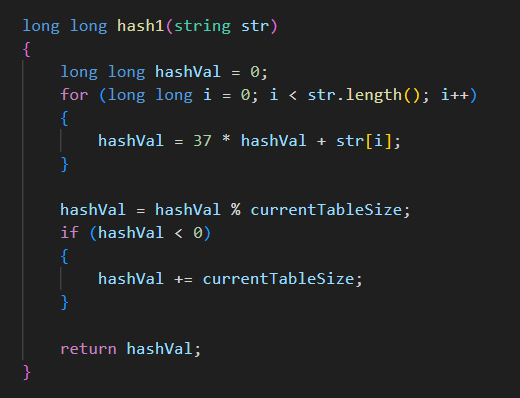
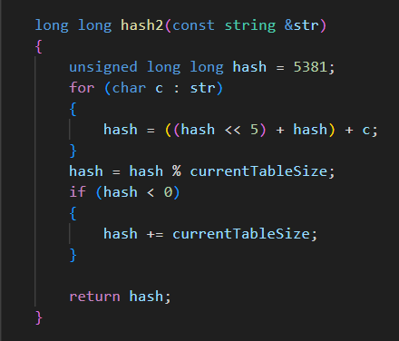

# Offline-7 Hashing

# Report

## By Nawriz Ahmed Turjo **(2105032)**

## Date: 19th February, 2024

**Important Paramemters**

- C1 => `32`
- C2 => `115`
- Maximum Chain Length => `3`

`Seed 1 => 2105032`

<table>
<tr>
    <th rowspan="2">Hash Table Size</th>
    <th rowspan="2">Collision Resolution Method</th>
    <th colspan="2">Hash Function 1</th>
    <th colspan="2">Hash Function 2</th>
</tr>
<tr>
    <th># of Collisions</th>
    <th>Average Probes</th>
    <th># of Collisions</th>
    <th>Average Probes</th>
</tr>
<tr>
    <td rowspan="3">N = 5000</td>
    <td>Chaining</td>
    <td>5125</td>
    <td>1.263</td>
    <td>5130</td>
    <td>1.256</td>
</tr>
<tr>
    <td>Double Hashing</td>
    <td>7514</td>
    <td>5.01</td>
    <td>7510</td>
    <td>2.896</td>
</tr>
<tr>
    <td>Custom Probing</td>
    <td>7486</td>
    <td>3.886</td>
    <td>7504</td>
    <td>3.405</td>
</tr>
<tr>
    <td rowspan="3">N = 10000</td>
    <td>Chaining</td>
    <td>4125</td>
    <td>1.263</td>
    <td>4129</td>
    <td>1.256</td>
</tr>
<tr>
    <td>Double Hashing</td>
    <td>5024</td>
    <td>6.52</td>
    <td>4937</td>
    <td>7.127</td>
</tr>
<tr>
    <td>Custom Probing</td>
    <td>5017</td>
    <td>6.335</td>
    <td>4943</td>
    <td>8.871</td>
</tr>
<tr>
    <td rowspan="3">N = 20000</td>
    <td>Chaining</td>
    <td>2115</td>
    <td>1.24</td>
    <td>2116</td>
    <td>1.261</td>
</tr>
<tr>
    <td>Double Hashing</td>
    <td>2461</td>
    <td>1.397</td>
    <td>2459</td>
    <td>1.337</td>
</tr>
<tr>
    <td>Custom Probing</td>
    <td>2475</td>
    <td>1.423</td>
    <td>2464</td>
    <td>1.375</td>
</tr>
</table>
  
```Seed 2 => 12103115```
<table>
<tr>
    <th rowspan="2">Hash Table Size</th>
    <th rowspan="2">Collision Resolution Method</th>
    <th colspan="2">Hash Function 1</th>
    <th colspan="2">Hash Function 2</th>
</tr>
<tr>
    <th># of Collisions</th>
    <th>Average Probes</th>
    <th># of Collisions</th>
    <th>Average Probes</th>
</tr>
<tr>
    <td rowspan="3">N = 5000</td>
    <td>Chaining</td>
    <td>5125</td>
    <td>1.28</td>
    <td>5130</td>
    <td>1.256</td>
</tr>
<tr>
    <td>Double Hashing</td>
    <td>7514</td>
    <td>4.736</td>
    <td>7510</td>
    <td>6.617</td>
</tr>
<tr>
    <td>Custom Probing</td>
    <td>7486</td>
    <td>5.694</td>
    <td>7504</td>
    <td>10.002</td>
</tr>
<tr>
    <td rowspan="3">N = 10000</td>
    <td>Chaining</td>
    <td>4125</td>
    <td>1.28</td>
    <td>4129</td>
    <td>1.256</td>
</tr>
<tr>
    <td>Double Hashing</td>
    <td>5024</td>
    <td>7.008</td>
    <td>4937</td>
    <td>8.713</td>
</tr>
<tr>
    <td>Custom Probing</td>
    <td>5017</td>
    <td>9.313</td>
    <td>4943</td>
    <td>7.479</td>
</tr>
<tr>
    <td rowspan="3">N = 20000</td>
    <td>Chaining</td>
    <td>2115</td>
    <td>1.243</td>
    <td>2116</td>
    <td>1.249</td>
</tr>
<tr>
    <td>Double Hashing</td>
    <td>2461</td>
    <td>1.393</td>
    <td>2459</td>
    <td>1.389</td>
</tr>
<tr>
    <td>Custom Probing</td>
    <td>2475</td>
    <td>1.396</td>
    <td>2464</td>
    <td>1.394</td>
</tr>
</table>

N.B.: These Seeds are for Choosing the Random Words in average probe calculation.

## Hash Functions

### Hash Function 1

 </img>

### Hash Function 2

 </img>
